# Linux-palvelimet ICI003AS2A-3006 / h1 - Oma Linux

## h1 x)
### Raportin kirjoittaminen
 - Hyvin jäsennelty raportti on tehokas tapa kirjata muistiin toimenpiteiden eri työvaiheita ja tuloksia.
 - Raportit soveltuvat myös pohjaksi toisille käyttäjille laadittaville ohjeistuksille.
 - Raportti:
     - On toistettava: samassa ympäristössä raportin pohjalta toistetun toimenpiteen tulee päätyä samaan lopputulokseen.
     - On täsmällinen: raportoi komennot, klikkaukset, kellonajat. Käytä aikamuotona imperfektiä. Testaa toiminta, raportoi miten. Raportoi myös odottamattomat tulokset ja epäonnistumiset. Tarvittaessa tee työkaluista tai koneista vikailmoitus asianmukaiselle taholle.
     - On helppolukuinen: kirjoita huolellisesti ja kanavaan sopivalla tavalla. Käytä väliotsikoita.
     - Viittaa lähteisiin: viittaus alkuperäiseen tekstiin on hyvän tavan ja akateemisen käytännön mukaista, sekä osoittaa kirjoittajan perehtyneen aihealueeseen
 - Mokia:
     - Sepittäminen: raportoi vain tekemiäsi töitä ja testejä. Sepitetyn raportin toistamiseen tuhrautuu aikaa.
     - Plagiointi: Muiden tuotosten (teksti, kuvat, testitulokset) esittäminen ominaan loukkaa tekijänoikeuksia.
  
Lähde: Karvinen, Tero 2006: Raportin kirjoittaminen. [https://terokarvinen.com/2006/raportin-kirjoittaminen-4/](https://terokarvinen.com/2006/raportin-kirjoittaminen-4/)

### FSF: Free Software Definition
 - Free Software antaa käyttäjilleen vapauden hallita ohjelmien toimintaa
 - Täyttääkseen Free Softwaren määritelmän, kaikkien seuraavien ehtojen tulee toteutua:
    - Ohjelmaa saa käyttää mihin tarkoitukseen tahansa (freedom 0)
    - Ohjelman lähdekoodia tulee voida tutkia ja muokata omiin tarkoituksiinsa sopivaksi (freedom 1)
       - Sisältää myös oikeuden yhdistellä ja poistaa aliohjelmia
    - Ohjelmaa kopioita saa jakaa eteenpäin (freedom 2)
       - Ohjelmaa voi jakaa ilmaiseksi tai korvausta vastaan ilman erillistä ilmoitusta alkuperäiselle tekijälle
       - Neljää vapautta tukevia rajoituksia voidaan alkuperäisen tekijän toimesta asettaa, esim. copyleft
    - Ohjelman muokattua versiota saa jakaa eteenpäin mahdollistaen muidenkin yhteisön jäsenten hyötyvän siitä (freedom 3)
       - Alkuperäisellä julkaisijalla on oikeus vaatia tiettyjä muutoksia muokattuun ohjelmaan, kuten nimen muuttamista, logojen poistoa tai tehtyjen muutosten tunnustamista muokkaajan tekemiksi, kunhan vaatimukset eivät ole tarpeettoman työläitä toteuttaa.
       - Muokatun version lisensointia ei voida alkuperäisen lisenssin toimesta rajoittaa. Voi olla myös nonfree.
 - Mikäli kaikki ehdot eivät täyty, käytetään ohjelmasta termejä "nonfree" tai "propietary"
 - Kaupallinen käyttö ja jakelu on sallittua
 - Pääsy lähdekoodiin on edellytys vapauksien 1 ja 3 toteutumiselle
 - Lisenssin tulee olla pysyvä, eikä julkaisija saa tehdä siihen jälkeenpäin muutoksia

Lähde: GNU - Free Software Foundation: What is Free Software? [https://www.gnu.org/philosophy/free-sw.html](https://www.gnu.org/philosophy/free-sw.html) 

## h1 a)

Harjoitus tehty torstaina 24.8.2023 kello 21:29 alkaen. Vaihtelun ja oppimiskokemuksen vuoksi Linuxin asennus tehty Applen MacBook Pro 14" -laitteelle. Ensimmäinen asennuskerta epäonnistui, mutta pienillä muutoksilla (tai tuurilla) toinen yritys tuotti halutun lopputuloksen.

### Isäntälaitteen tiedot:
    MacBook Pro M1 Pro (2021)
    Prosessori: M1 Pro (8-core)
    RAM: 16Gt
    SSD: 512Gt
    OS: MacOS Sonoma 14.0
  
#### UTM asennus
1. Latasin UTM:n asennustiedoston osoitteesta [https://mac.getutm.app ](https://github.com/utmapp/UTM/releases/latest/download/UTM.dmg)
2. Avasin ladatun UTM.dmg -tiedoston
   --> Levy UTM mountattu työpöydälle
3. Avasin UTM:n levykuvan tuplaklikkaamalla sitä ja suoritin ohjelman asennuksen raahaamalla UTM:n kuvakkeen Applications-kansioon
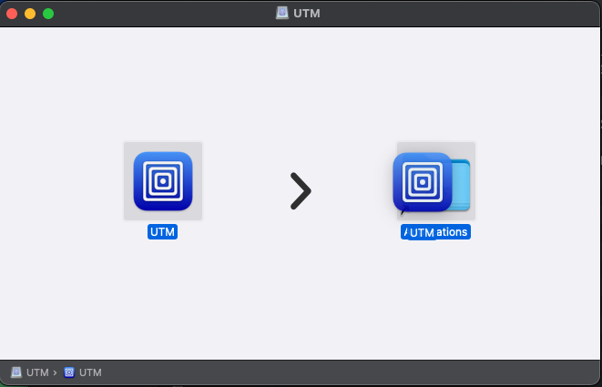
4. Avasin UTM:n hakemalla sen Spotlight search -toiminnolla ( + välilyönti) hakusanalla UTM
5. Käyttöjärjestelmän varoitus: "“UTM” is an app downloaded from the internet. Are you sure you want to open it?"
   --> Painoin "Open"
6. UTM ilmoitti What's new -tervetuloviestillä uusista ominaisuuksistaan, jotka ohitin vahingossa painamalla enteriä väärässä ikkunassa.

#### Virtuaalikoneen asennus
7. Latasin Debianin levykuvan osoitteesta [https://cdimage.debian.org/debian-cd/current-live/amd64/iso-hybrid/debian-live-12.1.0-amd64-xfce.iso](https://cdimage.debian.org/debian-cd/current-live/amd64/iso-hybrid/debian-live-12.1.0-amd64-xfce.iso)
8. Aloitin virtuaalikoneen luomisen painamalla UTM:ssä "Create a New Virtual Machine"
9. Auenneesta ikkunassa oli vaihtoehdot Virtualize ja Emulate. Valitsin Emulate, koska Debianin virtualisointi ei onnistu ARM-arkkitehtuurilla. Debianista oli tarjolla vain amd64-arkkitehtuurin versiota.
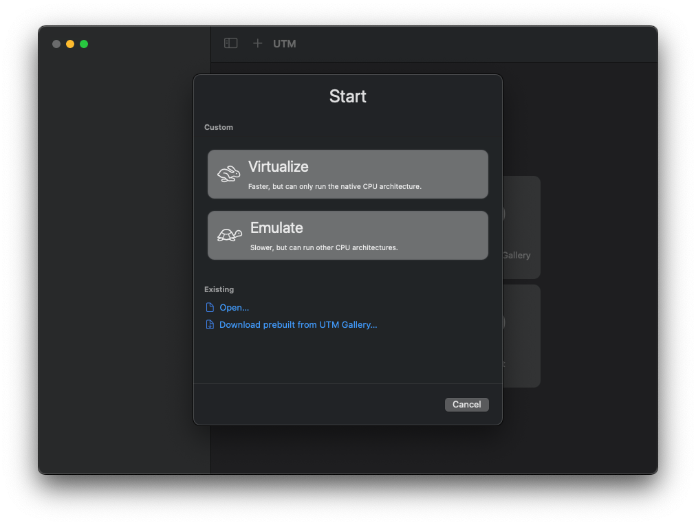
10. Seuraavassa ikkunassa oli vaihtoehtoina valita valmiiksi konfiguroidut versiot Windowsista tai Linuxista, joiden lisäksi oli vaihtoehto Other. Valitsin Other, koska halusin asentaa Linuxin jo lataamastani tiedostosta.
11. Asennuslevykuvan valinnassa etsin UTM:n browse-ominaisuudella lataamani levykuvan ja klikkasin "open". Tämän jälkeen painoin "Continue"
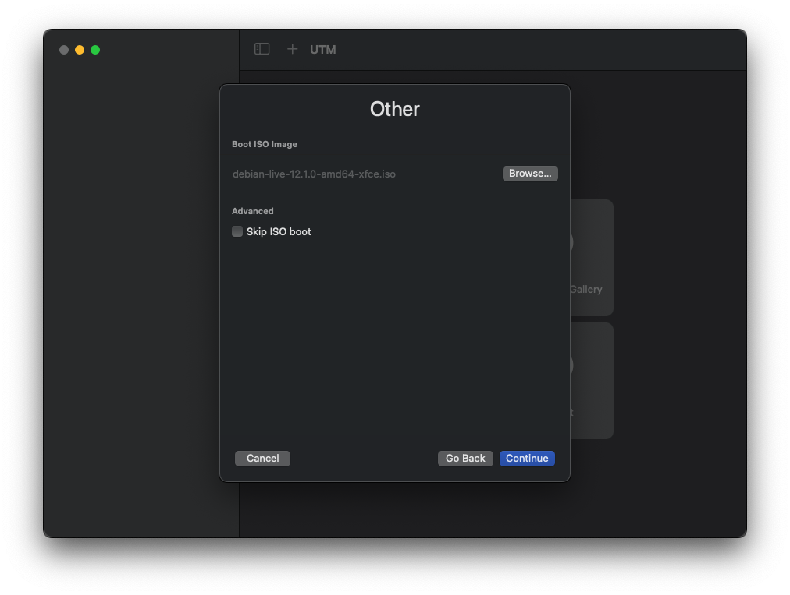
13. Valitsin kuvan mukaiset asetukset ja painoin "Continue". Kaikki muut olivat vakioarvoja, paitsi CPU Cores, joita valitsin manuaalisesti 4 kappaletta.
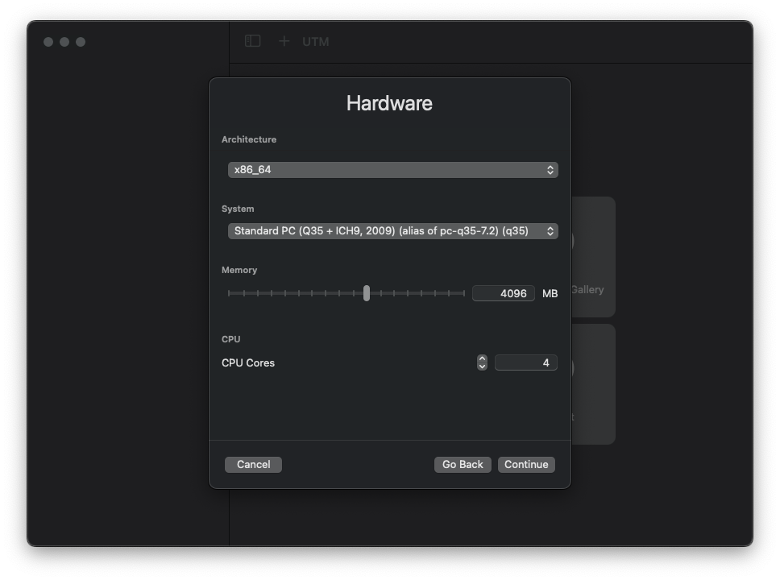
14. Storage-ikkunasta valitsin aseman kooksi 64Gt ja painoin Continue.
15. Shared Storage -ikkunassa en tehnyt mitään muutoksia, vaan painoin Continue. En määrittänyt erillistä jaettua kansiota isäntäkoneelta.
16. Summary-ikkunassa annoin virtuaalikoneelle nimen debian-12.1.0-xfce ja painoin Save.
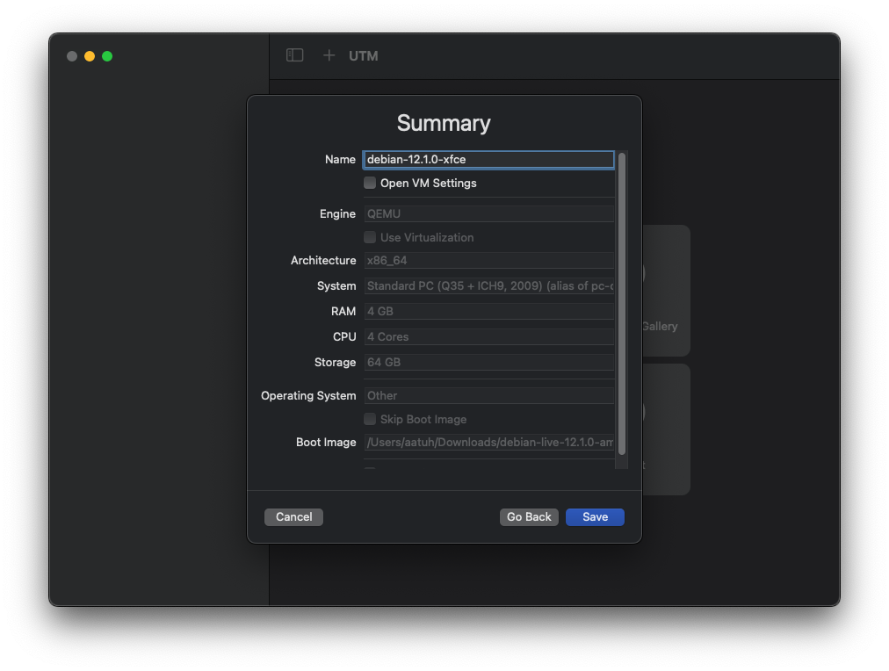
17. Luotu virtuaalikone ilmestyi UTM:n ikkunan vasempaan reunaan. Painoin tästä play-nappia ja kone käynnistyi.

#### Debianin asennus virtuaalikoneeseen
18. Valitsin virtuaalikoneeseen auenneesta Live Boot menusta vaihtoehdon Live system (amd64) ja painoin Enter
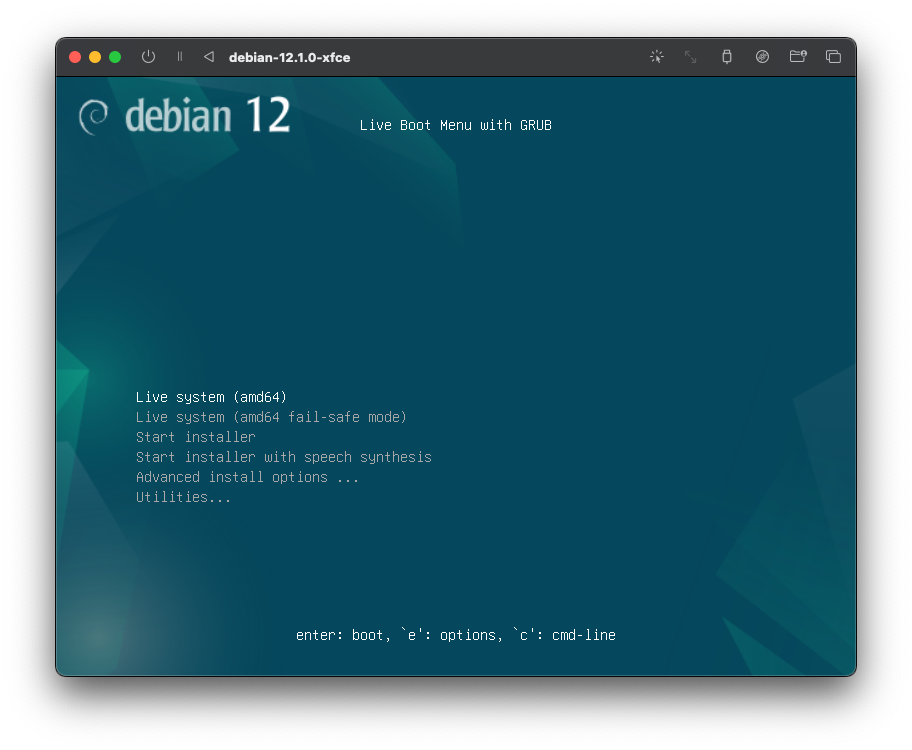
19. Noin kolmen minuutin odottamisen jälkeen virtuaalikoneen ruutu meni mustaksi ja UTM pyysi isäntäkäyttöjärjestelmältä oikeuksia käyttää mikrofonia. Painoin "OK", ja jatkoin odottamista mustan ruudun äärellä vielä noin toiset 3 minuuttia, kunnes debian käynnistyi.
20. Testasin internet-yhteyden toiminnan avaamalla Firefoxin ja siirtymällä sivulle iltalehti.fi\
    -- huomio: kone toimii erittäin hitaasti emuloidessa. Selaimen avaaminen kesti noin 30s ja iltalehti noin 15s, mutta yhteys toimi.
21. Suljin selaimen painamalla oikean yläkulman raksia ja siirryin Debianin asennukseen.
22. Debianin työpöydällä oli pikakuvake "Install Debian". Avasin tämän tuplaklikkaamalla.
23. Käyttöjärjestelmä ilmoitti, ettei ole tiedosto luotettavassa sijainnissa ja kyseli, asennetaanko tämä silti.\
    -- screenshottia ottaessa virheilmoitus: "Failed to run "install-debian.desktop" - Timeout was reached."\
    --> Close
    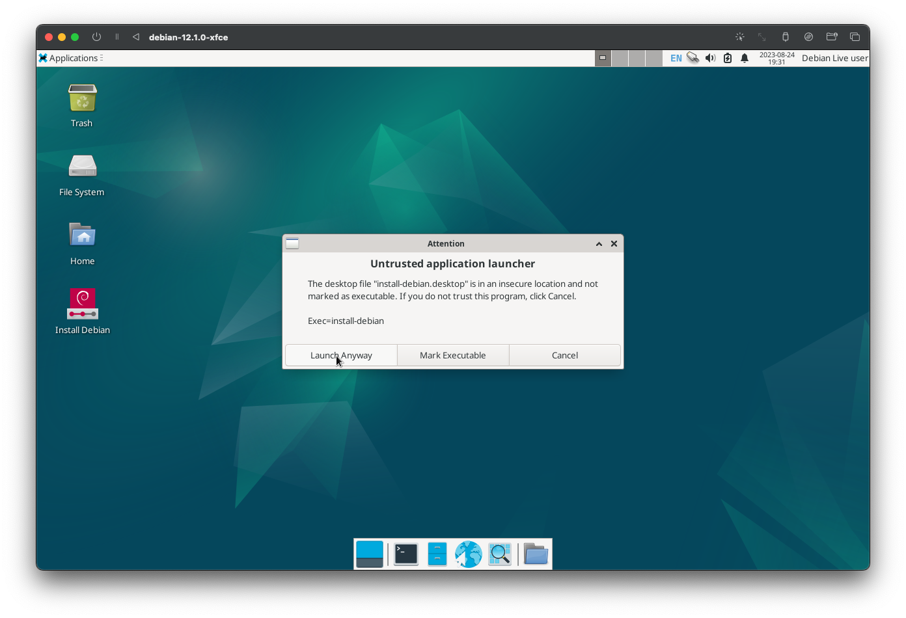
25. Edellinen virheilmoitus jäi kuitenkin näkyviin, ja painoin "Launch anyway".
26. Debian GNU/Linux Installer avautui. Ensimmäisenä valitsin kieleksi American English ja painoin "Next".
27. Location-kohdassa tein seuraavat valinnat ja painoin "Next".
    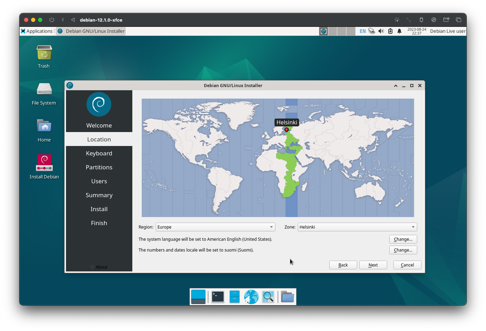
28. Keyboard-valinnat ja merkkien testaus --> "Next":
    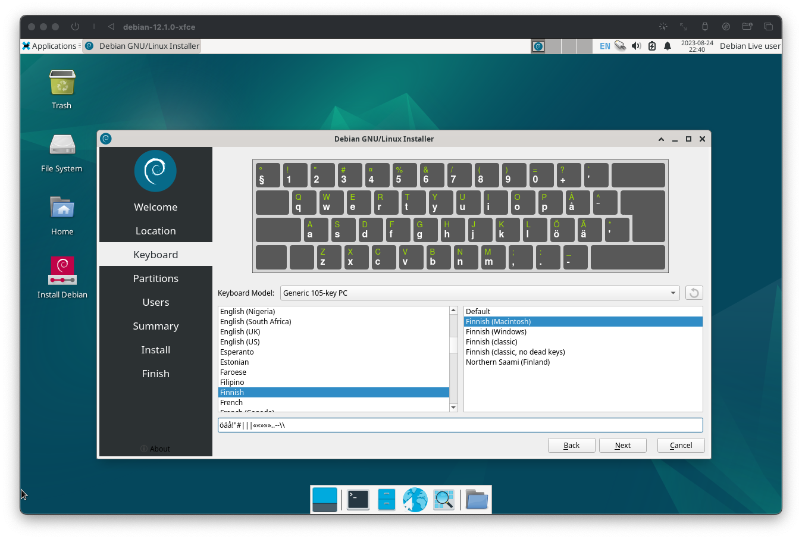
29. Partitions-kohdassa valitsin Erase disk ja painoin "Next".
30. Users-asetukset:
    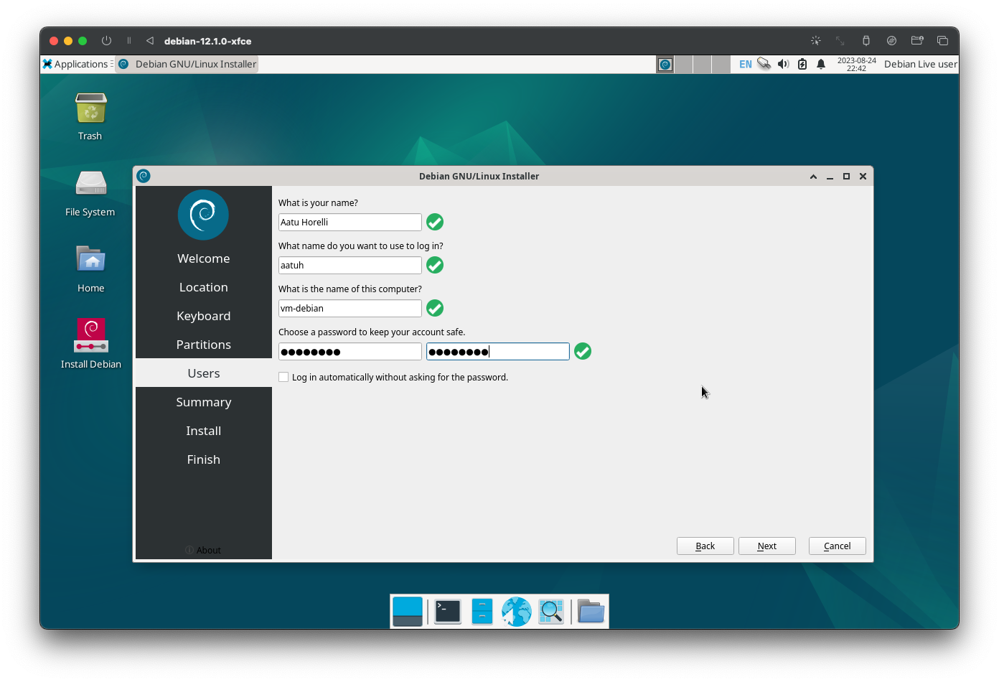
31. Yhteenveto asetuksista näytti tältä. Painoin Install.
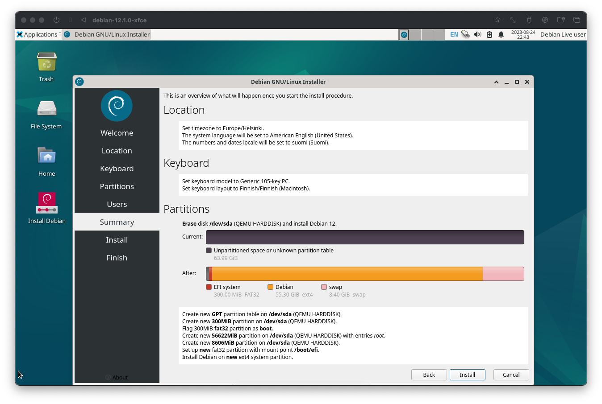
32. 19 minuutin jälkeen virtuaalikoneen ruuutu pimeni. Hiirtä liikuttamalla Debianin kirjautumisikkuna avautui. Asennuksessa asetettu käyttäjätunnus/salasana-yhdistelmä ei kuitenkaan toiminut. Uudelleenkäynnistyksen jälkeen Debianin live boot menu aukesi.
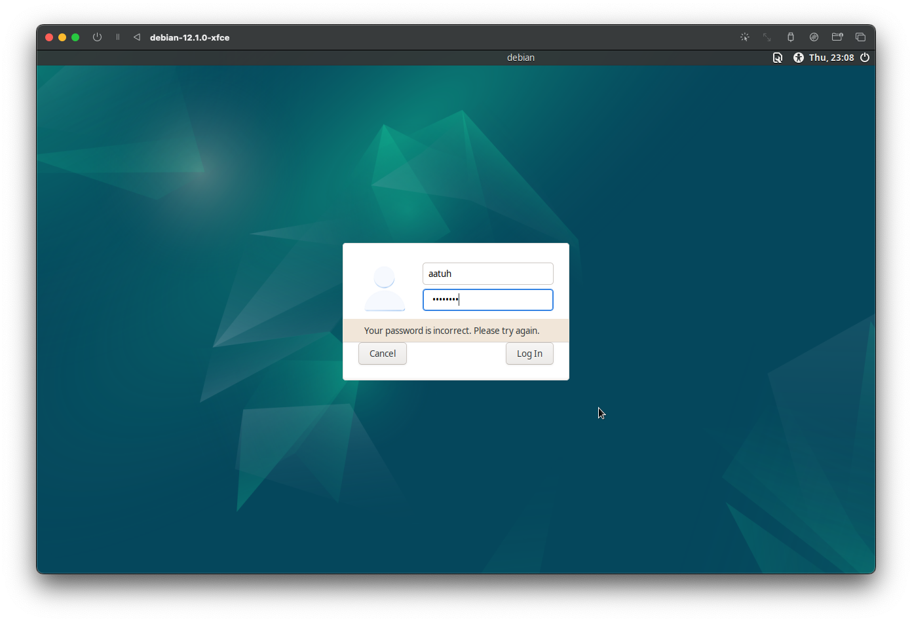
33. Sammutin virtuaalikoneen UTM:n pääikkunasta. debian-12.0.1-xfce - Rightclick - Stop.
34. Vaihdoin boottausjärjestystä UTM:n asetuksista tarkistaakseni, onko asennus pilalla. debian-12.0.1-xfce - rightclick - edit. Asetuksissa tunnistettiin kaksi asemaa, joista toinen oli asennuksessa käytetty levykuva ja toinen kiintolevy. Siirsin kiintolevyn ylimmäksi käynnistysvaihtoehdoksi raahaamalla sen listan kärkeen.
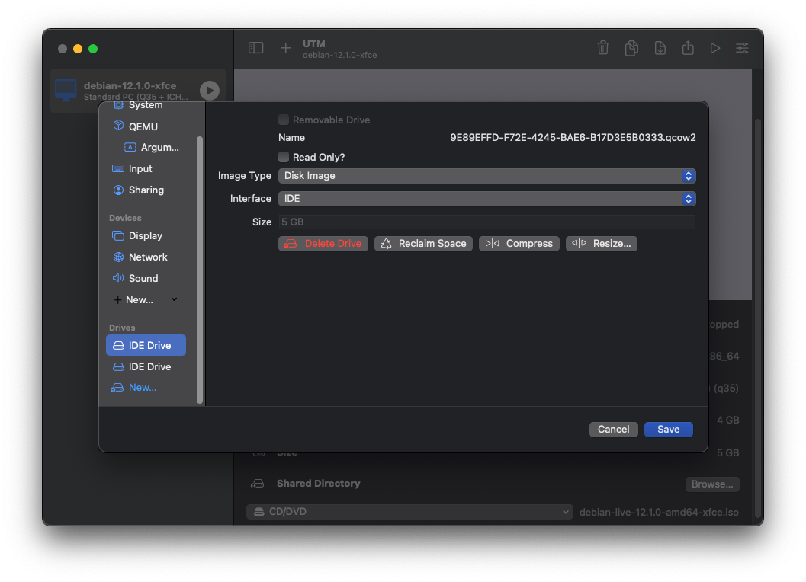

## Toinen yritys

34. Käynnistin virtuaalikoneen play-nappia painamalla ja päädyin takaisin live boot menuun. Toistin kohdat 18-30, mutta tällä kertaa laitoin 29. kohdassa rastin ruutuun "Log in automatically without asking for the password."
35. Tällä kertaa asennus kesti noin 45 minuuttia. Asennuksen jälkeen käynnistin koneen uudelleen. Ilmeisesti ensimmäisellä kerralla on tapahtunut jokin virhe, koska kesken asennusprosessin käyttöjärjestelmä tuntui käynnistyneen uudelleen ja vaativan salasanaa, mutta toisella yrityksellä uudelleenkäynnistys piti tehdä itse asennuksen valmistuttua.
36. Virtuaalikoneen bootattua Debianiin, testasin salasanan toimivuuden terminalissa komennolla:
37.     sudo apt-get install vim
37. Asennus kysyi salasanaa, joka tällä kertaa toimi.  
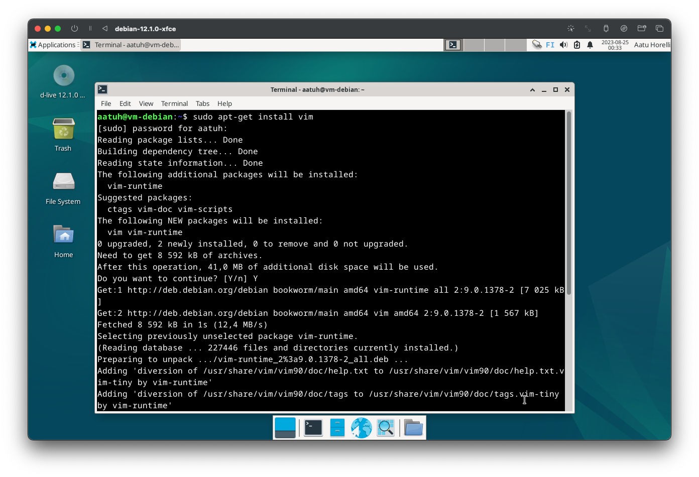

Tätä dokumenttia saa kopioida ja muokata GNU General Public License (versio 2 tai uudempi) mukaisesti. http://www.gnu.org/licenses/gpl.html
