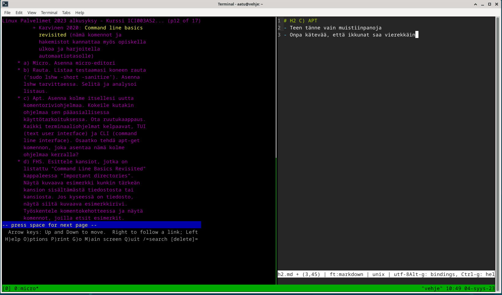
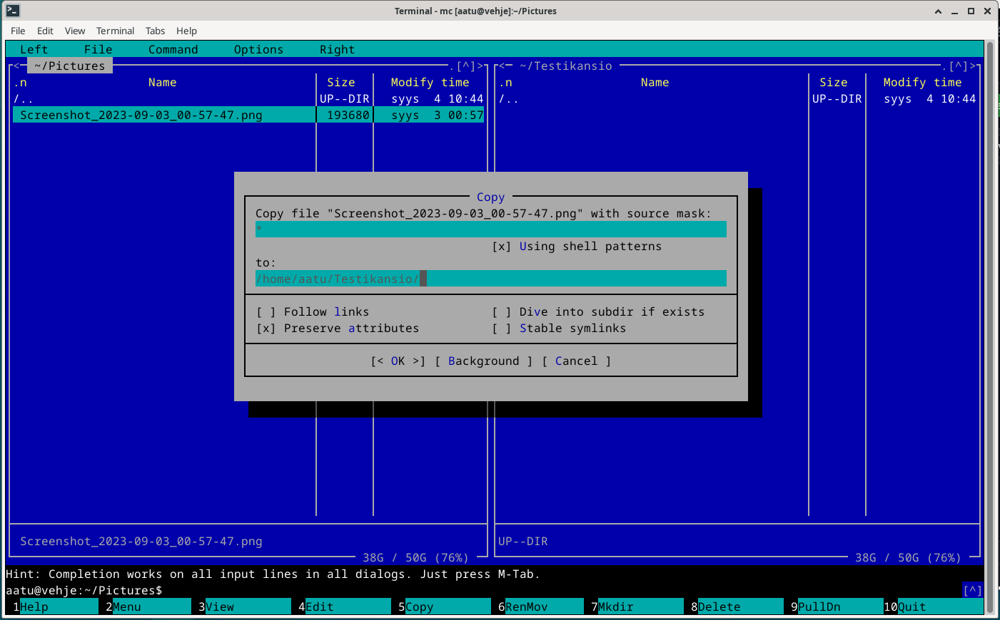

# h2 - Komentaja Pingviini

## x) Tiivistelmä: Command line basics revisited
 - Komentokehote on nopea, tehokas ja helposti automatisoitavissa
 - Peruskomennot
 	- ```$ pwd```tulostaa tämänhetkisen sijainnin.
 	- ```$ ls```listaa nykyisen kansion sisällön.
 	- ```$ less```tekstin(tiedosto/komento) lukeminen. Space kelaa eteenpäin, b taaksepäin.
 - Liikkuminen tiedostojärjestelmässä:
 	- ```$ cd testikansio/``` siirtyy testikansioon
 	- ```$ cd ..```palaa ylempään polkuun
 - Tiedostonhallinta:
 	- ```$ mkdir```  luo kansion nykyiseen hakemistoon
 	- ```$ mv``` tiedostojen/kansioiden siirtäminen tai uudelleennimeäminen
 	- ```$ cp``` kopiointi
 	- ```$ nano``` - tekstieditori, käyttö: nano tiedosto.txt
 	- ```$ rmdir``` tyhjän kansion poistaminen
 	- ```$ rm``` tiedoston poistaminen
   - ```$ rm -r KANSIO/``` poistaa kansion sisältöineen
      - $ rm ei varoittele poistaessa. Käyttö harkitusti.
 - SSH
 	- Turvallinen tapa muodostaa etäyhteys palvelimen shelliin
 	- ```$ ssh nimi@palvelin.com```
 - Paketinhallinta
 	- Pakettilistan päivitys: ```$ sudo apt-get update```
 	- Ohjelmien asennus: ```$ sudo apt-get install <nimi>```
 	- Ohjelmien poisto: ```$ sudo apt-get purge <nimi>```
 - $ sudo
 	- käytetään koko järjestelmään vaikuttavien komentojen kanssa. Varmistaa käyttäjältä salasanan.
 		- esim. ```sudo apt-get update```
 - Ohjeet: $ man <komento>, esim. ```man ls```
 - Komentojen yhdistäminen (_piping_)
 	- komentojen väliin "|", esim: ```ls  /etc | less```

 Lähde: Karvinen, Tero (2020), Command Line Basics Revisited. Luettavissa: https://terokarvinen.com/2020/command-line-basics-revisited/
 		
## a) Micron asennus
 - Micro asennettu jo etukäteen. Käytetyt komennot:
```
sudo apt-get update
sudo apt-get -y install  micro
```

## b) Rauta
```
sudo lshw -short -sanitize
--------------------------------
 H/W path            Device      Class       Description
 =======================================================
                                 system      VirtualBox
 /0                              bus         VirtualBox
 /0/0                            memory      128KiB BIOS
 /0/1                            memory      8GiB System memory //RAM määrä
 /0/2                            processor   Intel(R) Core(TM) i7-6700K CPU @ 4.00GHz //PSama kuin isäntälaitteessa
 /0/100                          bridge      440FX - 82441FX PMC [Natoma]
 /0/100/1                        bridge      82371SB PIIX3 ISA [Natoma/Triton II]
 /0/100/1/0                      input       PnP device PNP0303
 /0/100/1/1                      input       PnP device PNP0f03
 /0/100/1.1          scsi1       storage     82371AB/EB/MB PIIX4 IDE
 /0/100/1.1/0.0.0    /dev/cdrom  disk        CD-ROM
 /0/100/1.1/0.0.0/0  /dev/cdrom  disk        
 /0/100/2            /dev/fb0    display     SVGA II Adapter
 /0/100/3            enp0s3      network     82540EM Gigabit Ethernet Controller
 /0/100/4            input8      input       VirtualBox mouse integration
 /0/100/5            card0       multimedia  82801AA AC'97 Audio Controller
 /0/100/6                        bus         KeyLargo/Intrepid USB
 /0/100/6/1          usb2        bus         OHCI PCI host controller
 /0/100/6/1/1        input6      input       VirtualBox USB Tablet
 /0/100/7                        bridge      82371AB/EB/MB PIIX4 ACPI
 /0/100/b                        bus         82801FB/FBM/FR/FW/FRW (ICH6 Family) USB2 EHCI Controller
 /0/100/b/1          usb1        bus         EHCI Host Controller
 /0/100/d            scsi2       storage     82801HM/HEM (ICH8M/ICH8M-E) SATA Controller [AHCI mode]
 /0/100/d/0.0.0      /dev/sda    disk        64GB VBOX HARDDISK //Kiintolevy
 /0/100/d/0.0.0/1    /dev/sda1   volume      51GiB EXT4 volume //Kiintolevyn partitio. EXT4-tiedostojärjestelmä
 /0/100/d/0.0.0/2    /dev/sda2   volume      9011MiB Linux swap volume //Swapille varattu tila kiintolevyltä. Hyödynnetään RAM loppuessa kesken.
 /1                  input0      input       AT Translated Set 2 keyboard
 /2                  input2      input       Power Button
 /3                  input3      input       Video Bus
 /4                  input4      input       Sleep Button
 /5                  input5      input       ImExPS/2 Generic Explorer Mouse
 /6                  input7      input       PC Speaker
```
- lshw kuvaa laitteen kokoonpanoa [1]
  - H/W path: numeerinen hierarkinen kuvaus komponenttien poluista. Auttaa ymmärtämään, miten eri komponentit liittyvät toisiinsa. [2]
     - 0/0, 0/1, 0/2 emolevyn pohjoissillassa (cpu, muistit, PCI-e)
     - 0/100/x  emolevyn eteläsillassa
  - Device: looginen nimi, jolla järjestelmä tunnistaa laitteen. [1]
  - Class: yleiskuvaus komponentin tyypistä. Esim. processor / disk. [1]
  - Description: komponentin kuvaus [1]

 

Lähteet:
 
 [1] HardwareLiSter - ezIX - How to interpret lswh output. 
 https://ezix.org/project/wiki/HardwareLiSter#Howtointerpretlshwsoutput) 
 
 [2] Linux H/W paths - Linux & Unix. https://www.bleepingcomputer.com/forums/t/565295/linux-hw-paths/
 
## C) apt
 - Kolmen ohjelman asennus yhdellä kertaa:
 ```
  apt-get -y install lynx tmux mc
 ```
 - Lynx: terminaalipohjainen verkkoselain
 - tmux: yhden terminaali-ikkunan jakaminen useammalle ohjelmalle
    - Esimerkissä terminaali jaettu Lynx-selaimelle ja microlle
     
 - mc: tiedostojärjestelmän käyttöliittymä. Jaettu kahteen ikkunaan. Helpottaa esim. tiedostojen kopioimista.
   
## D) FHS
 - / tiedostojärjestelmän juurikansio. Kaikki muu rakennettu juuren päälle.
```
cd /
pwd
ls
```
 - /home/ sisältää käyttäjien kotihakemistot. Koneella yksi käyttäjä. Kotihakemisto löytyy seuraavasti:
```
cd home
pwd # tulostaa /home
ls # tulostaa aatu
``` 
 - /home/aatu käyttäjän "aatu" oma kotihakemisto, jonne vain tämä käyttäjä voi tallentaa pysyvästi dataa. Olen tallentanut esimerkiksi kansion git/, jonka kautta suoritan kotitehtävien palauttamisen
```
cd aatu
pwd
ls
cd git # githubille pyhitetty kansio
```
 - /etc/ ohjelmien järjestelmänlaajuiset asetukset. Tiedostoja ja kansioita, esim. apache2/.
```
cd /etc/
ls | less
cd apache2/
pwd # tulostaa /etc/apache2
```
 - /media/ sisältää siirrettävän median liitoskohdat, kuten cdrom tai usbdisk. Tällä hetkellä virtuaalikoneessa ei mitään liitettynä. Tarkistus komennoilla:
```
cd /media/
pwd # tulostaa /media
ls # tulostaa aatu
cd aatu
ls # tyhjä hakemisto, ei liitettyjä medioita
```
 - /var/log/ järjestelmän erilaiset lokitiedostot. Esim. /var/log/apt, jossa asennusten lokitiedosto history.log
```
cd /var/log/
pwd
ls 
cd apt
ls
less history.log

Tulostaa lokia asennuksista, esim:
# Start-Date: 2023-09-02  23:25:58
# Commandline: apt-get install git
# Requested-By: aatu (1000)
```  
## E & F) The Friendly M & Pipe
 - $ grep -komennolla voidaan etsiä merkkijonoja
 - yhdistettävissä muihin komentoihin, kuten find ja less.
 - Esimerkkitapaus: etsitään kotihakemistosta kaikki *.png-muotoiset kuvat. Find listaa kaikki tiedostot, grepillä rajataan hakutulokset tiedostoihin, joissa esiintyy merkkijono .png. Hallitumpi hakutulosten käsittely less:llä.
    ```
    cd /home/aatu/
    find | grep .png | less
    ``` 
 - Esimerkki 2: salasana oikeaoppisesti piilotettu tekstitiedostoon satunnaisten rivien keskelle. Salasanassa esiintyi varmaankin sana 'kissa', mutta muilta osin muisti on pettänyt.  
   ```
   less ei_ainakaan_salasanaa_taalla.txt | grep kissa
    ```
   
 - tulostaa tiedostosta hakusanaa 'kissa' vastaavat osumat: _kissa123_
  

## G) Tukki
 - Lokin avaaminen ja seuraaminen:
```
sudo journalctl -f
```
 - Onnistunut suoritus: 
```
syys 03 22:35:24  vehje     sudo[3343]:      aatu     :    TTY=pts/3    ; PWD=/home/aatu     ;   USER=root        ;          COMMAND=/usr/bin/apt-get update
[aikaleima]      [hostname] [prosessi]      [käyttäjä]                    [missä suoritettu]    [root-oikeuksia käytetty]    [suoritettu komento]
```

 - Epäonnistunut suoritus:

   - Toisessa terminaali-ikkunassa ajettu komento ```sudo apt-get update``` ja syötetty salasana kolmesti väärin
```
syys 03 23:03:35 vehje        sudo[6290]:     aatu      :   3 incorrect password attempts ; TTY=pts/3 ; PWD=/home/aatu   ;   USER=root       ;    COMMAND=/usr/bin/apt-get update
[aikaleima]      [hostname]   [prosessi]      [käyttäjä]    [virheilmoitus]                            [missä suoritettu]    [root-oikeudet]      [suoritettu komento]
```
