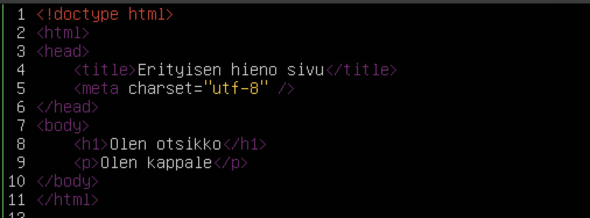

# H3 - Hello web server

## x) Tiivistelmä
 - Apachen asennus vaiheittain:
   - Asennus: ```sudo apt-get install apache2```
   - Testaa vastaako palvelin kutsuihin (localhost / selvitä osoite: $ ip addr)
   - Anna käyttäjille oikeus luoda kotisivuja: Ota userdir käyttöön ```sudo a2enmod userdir``` ja käynnistä Apache uudelleen ```sudo systemctl restart apache2```
     - Käyttäjien kotisivujen ollessa käytössä, kaikki public_html-kansioon laitettu näkyy verkossa
     - Kansio public_html tulee vielä luoda kunkin käyttäjän kotihakemistoon
       ```
       cd
       mkdir public_html 
       ```

## Johdanto

Viikon Linux-tehtävät tehty testimielessä jälleen MacBookilla. Ehdin tutkiskella Apachea jo ennakkoon pöytäkoneella, joten raporttia varten päätin aloittaa puhtaalta pöydältä. Aiemmin Macille asentamani Debian toimi emuloituna niin hitaasti, että poistin sen ja asensin uudelle virtuaalikoneelle ARM-arkkitehtuuria tukevan Ubuntu Serverin (22.04.3 LTS). Oletan graafisen käyttöliittymän puuttumisen ja isäntälaitteen prosessoria tukevan käyttöjärjestelmän nopeuttavan Linuxia merkittävästi. 

### Isäntälaitteen tiedot:
    MacBook Pro M1 Pro (2021)
    Prosessori: M1 Pro (8-core)
    RAM: 16Gt
    SSD: 512Gt
    OS: MacOS Sonoma 14.0
    
## a) Apachen asennus

 - Aloitin varmistamalla lataavani pakettien tuoreimpia versioita komennolla ```sudo apt-get update```
 - Muistin tunnilta ladattavan paketin olevan nimeltään Apache2. Latasin ja asensin tämän komennolla ```sudo apt-get install apache2 -y```
 - Ubuntu tervehti asennuksessa varoituksella "Daemons using outdated libraries". Päätin selvittää vasta myöhemmin koituuko tästä ongelmia, ja painoin OK. 
 - Testasin, käynnistyikö Apache itsestään, vai tulisiko se tehdä itse. ```curl localhost | less``` Sivu vastasi pyyntöön ja palautti sivun lähdekoodin. 

## b) Apache lokianalyysi
 - Ensimmäisenä piti löytää Apachen lokitiedosto. Käytin tähän juurikansiossa komentoa ```sudo find | grep apache2 | less```. Selasin hakutulokset läpi ja polku /var/log/apache2 vaikutti lupaavalta, joten siirryin sinne ja tarkistin vielä kansion sisällön:
   ```
   cd /var/log/apache2
   ls
   ```
 - Kansiosta löytyi kolme tiedostoa, jotka tarkastin läpi ```tail [tiedostonimi]```
     - access.log ja error.log -tiedostoissa oli rivejä, other_vhosts_access.logissa ei.
     - Lokitiedostoja tarkastellessa huomasin järjestelmän kellonajan olevan 3 tuntia jäljessä. Aikavyöhyke oletettavasti väärä, koska aikaleimat näyttävät aikavyöhykkeeksi +0000. Päätin korjata tämänkin myöhemmin.
 - Avasin lokin muodostumista tarkastellakseni edellisen viikon tehtävistä tutun tmux-sovelluksen, jolla saan jaettua yhden terminaali-ikkunan useammaksi komennolla ```tmux```
   - Jaion ikkunan ensin sivusuunnassa kahteen osaan pikanäppäimiä käyttäen: ctrl + b -->  & (shift + 6)
   - Toisen ikkunan jako pystysuunnassa: ctrl + b --> " (shift + 2)
   - Avasin access- ja error.logien seurannan omiin ikkunoihinsa ja kolmatta ikkunaa käytin sivun kutsumiseen
    ```
    tail -f access.log
    tail -f error.log
    curl localhost
    ```
    
   - Lokitiedostojen tulkitsemisen apuna käytin epäselvissä kohdissa Apachen omaa dokumentaatiota
   - Access.log merkintä sivulatauksesta:
     ```
     127.0.0.1 - - [10/Sep/2023:19:03:27 +0000] "GET / HTTP/1.1" 200 19026 "-" curl/7.81.0"
     ```
       - 127.0.0.1 - Pyynnön lähettäjän(client) ip-osoite 
       - "-" tarkoittaa, että tietoa ei saatavilla.
         - Ensimmäisen "-" kohdalle ilmeisesti kirjataan clientin RFC 1413 identiteetti, jos tämä on saatavilla. Apache pyrkii hakemaan tämän ainoastaan, jos IdentityCheck on kytketty päälle.
         - Toisen "-" kohdalle kirjataan pyynnön lähettäjän käyttäjätunnus, jos kyseessä on HTTP tunnistautumista vaativa dokumentti. Apachen testisivu on avoin, joten tässä kenttä tyhjä.
    - [10/Sep/2023:19:03:27 +0000] - Palvelimen kellonaika lokimerkinnän muodostuessa. 10. syyskuuta 2023 kello 19:03:27, UTC-aikavyöhyke.
    - "GET / HTTP/1.1" - Clientin lähettämä pyyntö. GET = metodi, / = pyydetty sivu, HTTP/1.1 = käytetty protokolla. Client pyytää siis ilmeisesti lähettämään http://127.0.0.1/ sivun HTTP 1.1 protokollaa käyttäen.
    - 200 - Palvelimen palauttama statuskoodi. Apachen dokumentaation mukaan 2xx-alkuiset vastaukset viittaavat onnistuneeseen kutsuun. Kutsu on vastaanotettu, ymmärretty ja hyväksytty. 200 = OK
    - 10926 - Clientille palautetun objektin koko tavuina, ~11kt. 

Lähde: Apache HTTP Server - Log files: https://httpd.apache.org/docs/2.4/logs.html

## c) Apache esimerkkisivun vaihto
 - Apachen vakiomuotoisella index.html-sivulla kerrottiin sivun löytyvän polusta /var/www/html/index.html. Siiryin  sinne ja tarkistin kansion sisällön:
```
cd /var/www/html/
ls # tulostaa index.html
```
- Ajattelin säilyttää alkuperäisen sivun varmuuden vuoksi, joten tein siitä kopion ja poistin alkuperäisen.
```
sudo cp index.html index_orig.html
sudo rm index.html
```
- Koitin luoda uuden index.html -tiedoston echon avulla, mutta se ei sudo-oikeuksista riippumatta onnistunut, vaan sain ilmoituksen "-bash: index.html: Permission denied". Käytetty komento oli ```sudo echo peruna >> index.html```, jonka pitäisi luoda uusi index.html-niminen tiedosto, jonka sisällä on aiemman echo peruna -komennon mukaisesti sana "peruna".
- Tiedoston luominen onnistui kuitenkin touchilla, minkä jälkeen kävin kirjoittamassa sivulle sisältöä microlla.
  ```
  sudo touch index.html
  sudo micro index.html
  ```
- Testasin, päivittyikö sivun sisältö ilman Apachen uudelleenkäynnistystä ```curl localhost```
  - Palvelin palautti sanan peruna, joten uudelleenkäynnistystä ei tarvittu
  - Toisessa terminaali-ikkunassa pyörineestä access.logista pystyi myös päättelemään palvelimen palauttaneen 232 tavun suuruisen objektin vastauksena clientin pyyntöön.
 
## d) Käyttäjien kotisivut
 - Aloitin testaamalla, miten palvelin vastaa käyttäjäkohtaista sivua pyytäessä ```curl localhost/~aatu```
   - Ei toiminut, 404 not found. 
 - Kytkin käyttäjien kotisivut päälle Teron ohjeiden mukaan[1] ja käynnistin Apachen uudelleen
```
sudo a2enmod userdir
systemctl restart apache2
```
 - Näiden toimenpiteiden jälkeen sivu vastasi curliin '403 Forbidden', mikä viittaa siihen, ettei oikeutta sivun avaamiseen ole
 - Loin käyttäjän aatu alle uuden kansion public_html ja sinne tiedoston index.html. Tiedoston luominen onnistui ilman sudoa.
```
cd /home/aatu
mkdir public_html
echo peruna >> public_html/index.html
```
 - Lopuksi ajoin tehtävänannon vinkkiosiosta komennon ```chmod ugo+x $HOME $HOME/public_html/```, joka mahdollistaa käyttäjien public_html-kansion avaamisen muillekin kuin käyttäjälle itselleen
 - Testilataus curlilla toimi
   ```
   curl localhost/~aatu/index.html
   peruna
   ```
[1] Karvinen Tero - Install Apache Web Server on Ubuntu. https://terokarvinen.com/2008/05/02/install-apache-web-server-on-ubuntu-4/

## e) HTML5-sivu
 - Olin edelleen kansiossa /home/aatu/public_html/
 - Avasin aiemmin luomani index.html-tiedoston microlla ```micro index.html``` ja kirjoittelin sinne alkeellisen HTML5-sivun
   
 - Tallensin ja suljin tiedoston (ctrl + s & ctrl + q)
 - Testasin sivun toiminnan curlilla ```curl localhost/~aatu/index.html```


## f) Curl
 - curl [URL] pyytää palvelimelta syötetyn URLin mukaista sisältöä ja tulostaa sen sellaisenaan
 - ```curl localhost/~aatu/``` näyttää aiemmin luomani sivun lähdekoodin

 ```
aatu@mac-um-ubunty:/var/www/html$ curl localhost/~aatu/
<!doctype html><html>
<head>
‹title›Erityisen hieno sivu‹/title>
‹meta charset="utf-8" >
</head>
<body>
<h1>Olen otsikko</h1>
<p›Olen kappale</p>
</body>
</html>
```
- curl -I näyttää pyynnön mukana kulkevaa HTTP-metadataa.
- ```curl -I localhost/~aatu/```

```
aatu@mac-vm-ubuntu:/var/www/html$ cur1 -I localhost/~aatu/
HTTP/1.1 200 OK # HTTP-protokolla ja palvelimen vastaus: 200 OK
Date: Sun, 10 Sep 2023 21:06:17 GMT # Aikaleima 
Server: Apache/2.4.52 (Ubuntu) # Palvelimen tietoja. Käyttöjärjestelmä Ubuntu, Apachen versio 2.4.52
Last-Modified: Sun, 10 Sep 2023 20:51:12 GMT # Milloin sivua on viimeksi muokattu 
ETag: "a8-605075eb72cef" # Entity tag - arvo muuttuu aina sivun URLin sisällön muuttuessa
Accept-Ranges: bytes # Palvelin mahdollistaa selaimelle keskeytyneen latauksen jatkamisen
Content-Length: 168 # Sivun <body>-osion sisältö tavuina
Vary: Accept-Encoding
Content-Type: text/html # Sisällön tyyppi, html:ää tekstinä
```

Tulkitsemisen tukena käytetty MDN Web Docsia:


HTTP | MDN. https://developer.mozilla.org/en-US/docs/Web/HTTP/Headers)https://developer.mozilla.org/en-US/docs/Web/HTTP/Headers
  
